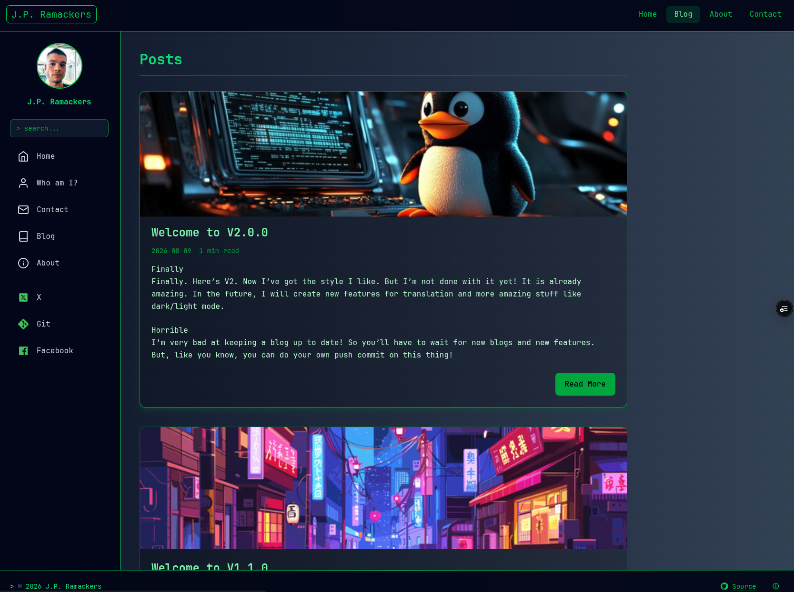

# BrainNotFound



My personal theme made with Hugo.

## Installation

This theme is designed to be used as a Hugo theme placed inside the `themes` directory.

### 1. Add the theme

Clone the repository into your Hugo project’s `themes` folder:

```bash
git clone https://github.com/ramackersjp/404BrainNotFound themes/404BrainNotFound
```

### 2. Install dependencies

This theme uses Tailwind CSS. Before building the site, install Node dependencies:

```bash
npm ci
```

### 4. Build the Hugo site

Generate the static site:

```bash
hugo build
```

### 5. Run the development server

Start the local development server:

```bash
hugo server
```

## Configuration

Make sure your Hugo configuration references the theme:

```toml
theme = "404BrainNotFound"
```

Node.js is required for building assets. Hugo must be installed and available in your system PATH.
